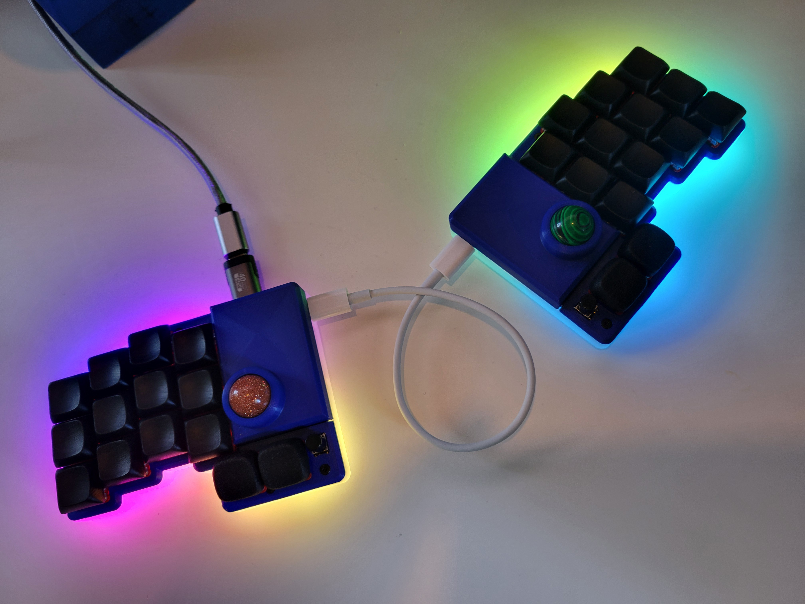
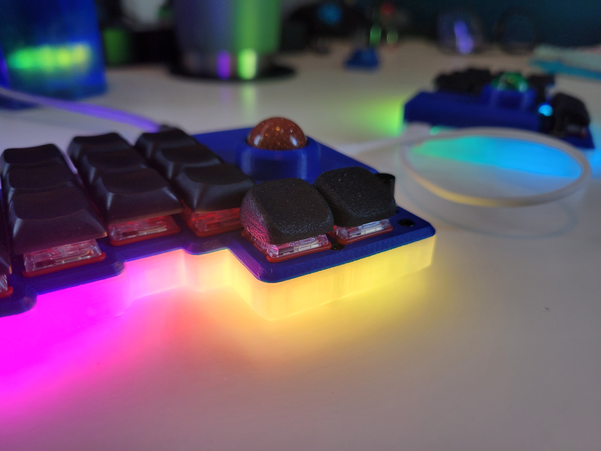
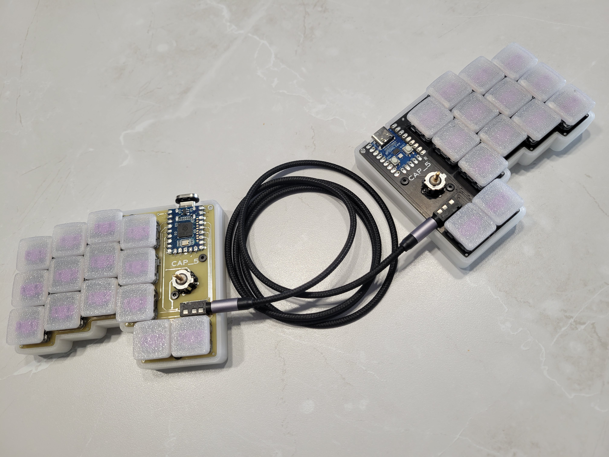

# BR/KN
BR/KN Keyboard (Broken)

[More pictures here](images/)

## Features

- 28 keys (plus 2 small tactiles, bonus!)
- 2x 16mm trackballs - PMw3360 sensors
- USB connection between halves (or TRRS option as backup)
- Low profile choc switches with CFX spacing (closer spacing then standard choc, only caps of size 16.50mm x 16.50mm will fit)
- RGB lighting
- Waveshare RP2040 Zero controllers
- QMK firmware

## Introduction

The Broken (stylized BR/KN) keyboard is named because... 

  1. it's a split (a broken unibody)
  2. Broken by Seether was my wife and mine's wedding song that I wanted to honor (queue awww's).  Ok enough on that, let's dig in.

I've always preferred small keebs and low switch counts.  The idea for this keyboard was to design a small split that also incorporated two trackballs (can use one for pointing, one for scrolling!), and have some other goodies like LEDs and tact switches for occasional needs like macros or toggling the RGB.

But how only 18 total letter keys?  By building a custom firmware layout and using combos for less used letters, or where they "feel best".  I performed some studies on letter frequency in the English language and most common bigrams and trigrams to determind the layout.  

![Layout][([http://www.keyboard-layout-editor.com/#/gists/a802ce065038acc9772d7e07f0fe1896](http://www.keyboard-layout-editor.com/#/gists/a802ce065038acc9772d7e07f0fe1896))](http://www.keyboard-layout-editor.com/##@_backcolor=%23dcdbdb&name=BR%2F%2FKN&author=mikemike&notes=Legend%2F:%0A%20Yellow%20Keys%20-%20Combos%0A%20Red%20Letters%20-%20Layers%0A%20Blue%20letters%20-%20Mods%0A%20,%20and%20.%20-%20double%20tap%0A%20Space%20and%20Enter%20-%20tap,%20hold%20for%20shift%0A%20%0Amiketronic%20%2F@github%0A%20%20%20%0A%20&background_name=Aluminium%20brushed&style=background-image%2F:%20url('%2F%2Fbg%2F%2Fmetal%2F%2Faluminum%2F_texture1642.jpg')%2F%3B%3B&switchMount=cherry&pcb:true&plate:false%3B&@_r:15&rx:1.5&ry:1.5&y:-1.5&x:0.5&t=%23000000%0A%23990b0b&p=CHICKLET&a:5&f:6&f2:2%3B&=F%0ATB%3B&@_y:-0.75&x:-0.5&c=%23ffffff&t=%23000000%3B&=W&_x:1&c=%23cccccc&t=%23000000%0A%23a80000&f:1&fa@:6&:2%3B%3B&=G%0ANUM%0A%0A%0ANUM%3B&@_y:-0.75&x:-1.5&c=%23ffffff&t=%23000000&f:4%3B&=TAB%3B&@_y:-0.5&x:0.5&c=%23cccccc&sm=cherry&f:3&fa@:6%3B%3B&=R%3B&@_y:-0.75&x:-0.5&t=%23000000%0A%23a80000&fa@:6&:2%3B%3B&=A%0AMACRO&_x:1&t=%23000000%0A%23a80000%0A%0A%0A%23a80000%3B&=S%0ASYM%0A%0A%0ASYM%3B&@_y:-0.75&x:-1.5&t=%23000000&f:3%3B&=SHIFT%3B&@_y:-0.5&x:0.5&t=%23000000%0A%0A%0A%0A%0A%0A%231400ff&fa@:6&:2&:0&:0&:0&:0&:2%3B%3B&=D%0A%0A%0A%0A%0A%0ACTRL%3B&@_y:-0.75&x:-0.5&t=%23000000%0A%23a80000%0A%0A%0A%23a80000%3B&=C%0AFN%0A%0A%0AFN&_x:1&t=%23000000%0A%0A%0A%0A%23a80000%0A%0A%231100ff%3B&=T%0A%0A%0A%0AALT%0A%0AALT%3B&@_y:-0.75&x:-1.5&t=%23000000%0A%0A%0A%0A%23a80000&f:4%3B&=Copy%0APaste%0A%0A%0AFN%3B&@_y:-0.25&x:2.5&t=%23a80000&f:3&fa@:0&:0&:0&:0&:0&:0&:4%3B%3B&=%0AShift%0A%0A%0A%0A%0ASpace%3B&@_r:16&rx:1&ry:1&y:-0.75&x:1.75&c=%23eef788&t=%23000000&p=FLAT&a:7&fa@:6%3B&w:0.7&h:0.5%3B&=B%3B&@_y:-0.95&x:0.75&a:5&f:1&fa@:6%3B&w:0.7&h:0.5%3B&=Q%3B&@_y:-0.050000000000000044&x:1.75&a:7&f:3&fa@:6%3B&w:0.7&h:0.5%3B&=P%3B&@_y:-0.95&x:0.75&a:5&f:1&fa@:6%3B&w:0.7&h:0.5%3B&=V%3B&@_y:-0.04999999999999982&x:1.75&a:7&f:3&fa@:6%3B&w:0.7&h:0.5%3B&=X%3B&@_y:-0.9500000000000002&x:0.75&a:5&f:1&fa@:6%3B&w:0.7&h:0.5%3B&=Z%3B&@_r:-15&rx:7.5&ry:1.5&y:-1.25&x:-0.75&c=%23cccccc&p=CHICKLET&f:6%3B&=L%3B&@_y:-0.75&x:-1.75%3B&=M&_x:1%3B&=U%3B&@_y:-0.75&x:-1&c=%23eef788&p=FLAT&w:0.7&h:0.5%3B&=J&_x:0.2999999999999998&a:7&f:2&w:0.7&h:0.5%3B&=BSPC&_x:0.5500000000000007&c=%23cccccc&p=CHICKLET&a:5&f:4%3B&=BSPC%3B&@_y:-0.5&x:-0.75&f:6%3B&=E%3B&@_y:-0.75&x:-1.75%3B&=N&_x:1%3B&=I%3B&@_y:-0.75&x:-1&c=%23eef788&p=FLAT&a:7&w:0.7&h:0.5%3B&=K&_x:0.2999999999999998&w:0.7&h:0.5%3B&=!&_x:0.5500000000000007&c=%23cccccc&p=CHICKLET&a:5&f:4%3B&=DEL%3B&@_y:-0.5&x:-0.75&f:3&fa@:6&:9%3B%3B&=O%0A,%3B&@_y:-0.75&x:-1.75&t=%23000000%0A%23a80000%0A%0A%0A%23a80000&f:6&fa@:0&:2&:0&:0&:2%3B%3B&=H%0AMOUSE%0A%0A%0AMOUSE&_x:1&t=%23000000&f:3&fa@:6&:9%3B%3B&=Y%0A.%3B&@_y:-0.75&c=%23eef788&p=FLAT&a:7&f:6&w:0.7&h:0.5%3B&=%3F&_x:0.5500000000000007&c=%23cccccc&p=CHICKLET&f:3%3B&=%3B&@_y:-0.25&x:-2.5&t=%23a80000&a:5&fa@:0&:0&:0&:0&:0&:0&:4%3B%3B&=%0AShift%0A%0A%0A%0A%0AEnter)

## Keycaps

As noted in the *Features*, I chose a narrower keyswitch spacing and thus they require narrower keycaps.  CFX keycaps are commercially available from Chosfox, or you can print your own, for which I've included files.  They easily print upside down on an FDM printer, and I use a textured baseplate.

## The predecessor (CAP 5)

[Another shot](images/20240416_134642.jpg)
